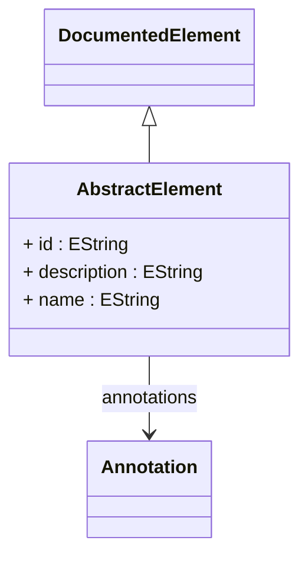

# AbstractElement

## Extends
- DocumentedElement [🔗](./class-DocumentedElement)
## Attributes

<table>
  <thead>
    <tr>
      <th>Name</th>
      <th>Id</th>
      <th>Typ</th>
      <th>Lower</th>
      <th>Upper</th>
    </tr>
  </thead>
  <tbody>
    <tr>
      <td><strong>id</strong></td>
      <td>true</td>
      <td><em>EString</em></td>
      <td>1</td>
      <td>1</td>
    </tr>
    <tr>
      <td colspan="5"><em> here you will see the description.</em></td>
    </tr>
    <tr>
      <td><strong>description</strong></td>
      <td>false</td>
      <td><em>EString</em></td>
      <td>0</td>
      <td>1</td>
    </tr>
    <tr>
      <td colspan="5"><em> here you will see the description.</em></td>
    </tr>
    <tr>
      <td><strong>name</strong></td>
      <td>false</td>
      <td><em>EString</em></td>
      <td>0</td>
      <td>1</td>
    </tr>
    <tr>
      <td colspan="5"><em> here you will see the description.</em></td>
    </tr>
  </tbody>
</table>

## References

<table>
  <thead>
    <tr>
      <th>Name</th>
      <th>Typ</th>
      <th>Lower</th>
      <th>Upper</th>
      <th>Containment</th>
    </tr>
  </thead>
  <tbody>
    <tr>
      <td><strong>annotations</strong></td>
      <td>Annotation<a href="./class-Annotation">🔗</a></td>
      <td>0</td>
      <td>&infin;</td>
      <td>true</td>
    </tr>
    <tr>
      <td colspan="5"><em> here you will see the description.</em></td>
    </tr>
  </tbody>
</table>

## Used by

## ClassDiagramm

