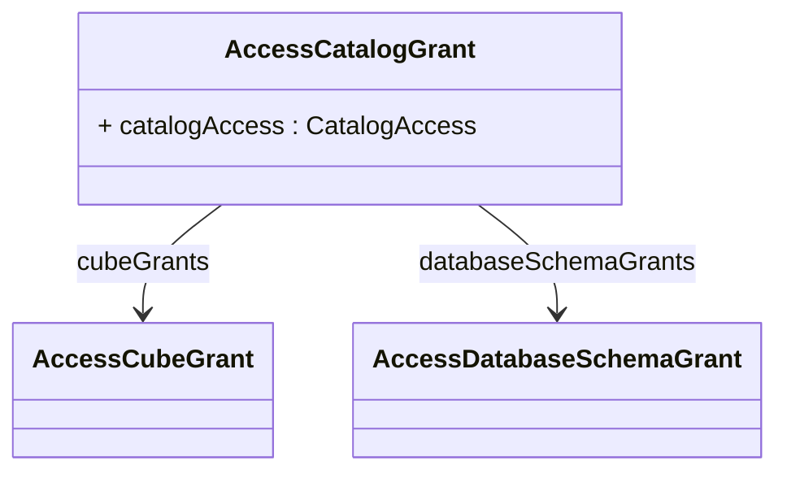

# AccessCatalogGrant

## Extends

## Attributes

<table>
  <thead>
    <tr>
      <th>Name</th>
      <th>Id</th>
      <th>Typ</th>
      <th>Lower</th>
      <th>Upper</th>
    </tr>
  </thead>
  <tbody>
    <tr>
      <td><strong>catalogAccess</strong></td>
      <td>false</td>
      <td><em>CatalogAccess<a href="./enum-CatalogAccess">🔗</a></em></td>
      <td>1</td>
      <td>1</td>
    </tr>
    <tr>
      <td colspan="5"><em> here you will see the description.</em></td>
    </tr>
  </tbody>
</table>

## References

<table>
  <thead>
    <tr>
      <th>Name</th>
      <th>Typ</th>
      <th>Lower</th>
      <th>Upper</th>
      <th>Containment</th>
    </tr>
  </thead>
  <tbody>
    <tr>
      <td><strong>cubeGrants</strong></td>
      <td>AccessCubeGrant<a href="./class-AccessCubeGrant">🔗</a></td>
      <td>1</td>
      <td>&infin;</td>
      <td>true</td>
    </tr>
    <tr>
      <td colspan="5"><em> here you will see the description.</em></td>
    </tr>
    <tr>
      <td><strong>databaseSchemaGrants</strong></td>
      <td>AccessDatabaseSchemaGrant<a href="./class-AccessDatabaseSchemaGrant">🔗</a></td>
      <td>1</td>
      <td>&infin;</td>
      <td>true</td>
    </tr>
    <tr>
      <td colspan="5"><em> here you will see the description.</em></td>
    </tr>
  </tbody>
</table>

## Used by

- AccessRole[🔗](./class-AccessRole) → accessCatalogGrants

## ClassDiagramm

