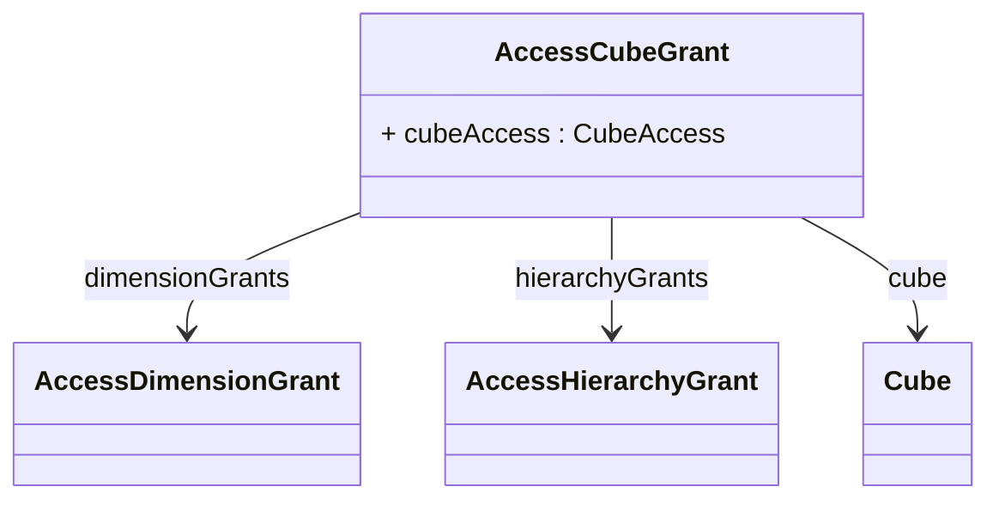

# AccessCubeGrant

## Extends

## Attributes

<table>
  <thead>
    <tr>
      <th>Name</th>
      <th>Id</th>
      <th>Typ</th>
      <th>Lower</th>
      <th>Upper</th>
    </tr>
  </thead>
  <tbody>
    <tr>
      <td><strong>cubeAccess</strong></td>
      <td>false</td>
      <td><em>CubeAccess<a href="./enum-CubeAccess">🔗</a></em></td>
      <td>1</td>
      <td>1</td>
    </tr>
    <tr>
      <td colspan="5"><em> here you will see the description.</em></td>
    </tr>
  </tbody>
</table>

## References

<table>
  <thead>
    <tr>
      <th>Name</th>
      <th>Typ</th>
      <th>Lower</th>
      <th>Upper</th>
      <th>Containment</th>
    </tr>
  </thead>
  <tbody>
    <tr>
      <td><strong>dimensionGrants</strong></td>
      <td>AccessDimensionGrant<a href="./class-AccessDimensionGrant">🔗</a></td>
      <td>0</td>
      <td>&infin;</td>
      <td>true</td>
    </tr>
    <tr>
      <td colspan="5"><em> here you will see the description.</em></td>
    </tr>
    <tr>
      <td><strong>hierarchyGrants</strong></td>
      <td>AccessHierarchyGrant<a href="./class-AccessHierarchyGrant">🔗</a></td>
      <td>0</td>
      <td>&infin;</td>
      <td>true</td>
    </tr>
    <tr>
      <td colspan="5"><em> here you will see the description.</em></td>
    </tr>
    <tr>
      <td><strong>cube</strong></td>
      <td>Cube<a href="./class-Cube">🔗</a></td>
      <td>1</td>
      <td>1</td>
      <td>false</td>
    </tr>
    <tr>
      <td colspan="5"><em> here you will see the description.</em></td>
    </tr>
  </tbody>
</table>

## Used by

- AccessCatalogGrant[🔗](./class-AccessCatalogGrant) → cubeGrants

## ClassDiagramm

