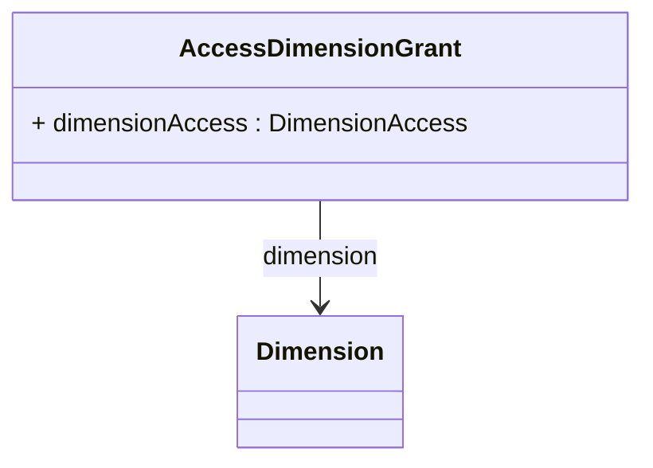

# AccessDimensionGrant

## Extends

## Attributes

<table>
  <thead>
    <tr>
      <th>Name</th>
      <th>Id</th>
      <th>Typ</th>
      <th>Lower</th>
      <th>Upper</th>
    </tr>
  </thead>
  <tbody>
    <tr>
      <td><strong>dimensionAccess</strong></td>
      <td>false</td>
      <td><em>DimensionAccess<a href="./enum-DimensionAccess">🔗</a></em></td>
      <td>1</td>
      <td>1</td>
    </tr>
    <tr>
      <td colspan="5"><em> here you will see the description.</em></td>
    </tr>
  </tbody>
</table>

## References

<table>
  <thead>
    <tr>
      <th>Name</th>
      <th>Typ</th>
      <th>Lower</th>
      <th>Upper</th>
      <th>Containment</th>
    </tr>
  </thead>
  <tbody>
    <tr>
      <td><strong>dimension</strong></td>
      <td>Dimension<a href="./class-Dimension">🔗</a></td>
      <td>1</td>
      <td>1</td>
      <td>false</td>
    </tr>
    <tr>
      <td colspan="5"><em> here you will see the description.</em></td>
    </tr>
  </tbody>
</table>

## Used by

- AccessCubeGrant[🔗](./class-AccessCubeGrant) → dimensionGrants

## ClassDiagramm

