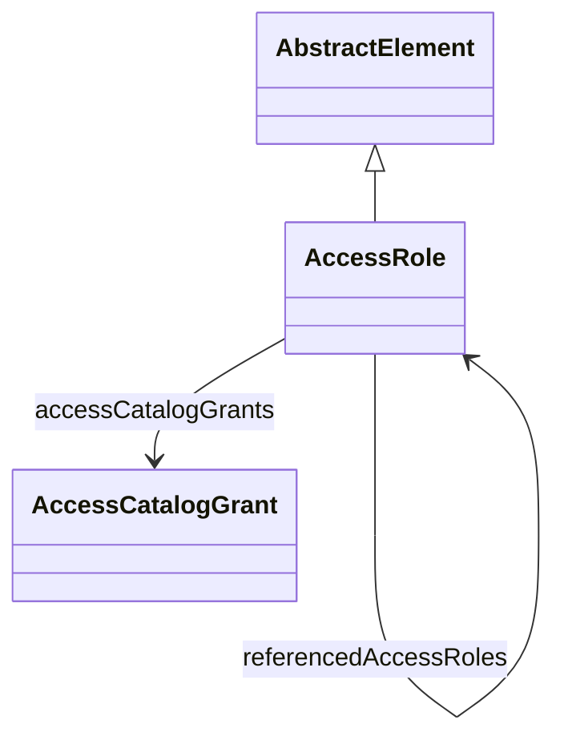

# AccessRole

## Extends
- AbstractElement [🔗](./class-AbstractElement)
## Attributes

<table>
  <thead>
    <tr>
      <th>Name</th>
      <th>Id</th>
      <th>Typ</th>
      <th>Lower</th>
      <th>Upper</th>
    </tr>
  </thead>
  <tbody>
  </tbody>
</table>

## References

<table>
  <thead>
    <tr>
      <th>Name</th>
      <th>Typ</th>
      <th>Lower</th>
      <th>Upper</th>
      <th>Containment</th>
    </tr>
  </thead>
  <tbody>
    <tr>
      <td><strong>accessCatalogGrants</strong></td>
      <td>AccessCatalogGrant<a href="./class-AccessCatalogGrant">🔗</a></td>
      <td>0</td>
      <td>&infin;</td>
      <td>true</td>
    </tr>
    <tr>
      <td colspan="5"><em> here you will see the description.</em></td>
    </tr>
    <tr>
      <td><strong>referencedAccessRoles</strong></td>
      <td>AccessRole<a href="./class-AccessRole">🔗</a></td>
      <td>0</td>
      <td>&infin;</td>
      <td>true</td>
    </tr>
    <tr>
      <td colspan="5"><em> here you will see the description.</em></td>
    </tr>
  </tbody>
</table>

## Used by

- Enviroment[🔗](./class-Enviroment) → accessRoles
- Catalog[🔗](./class-Catalog) → accessRoles
- Catalog[🔗](./class-Catalog) → defaultAccessRole

## ClassDiagramm

