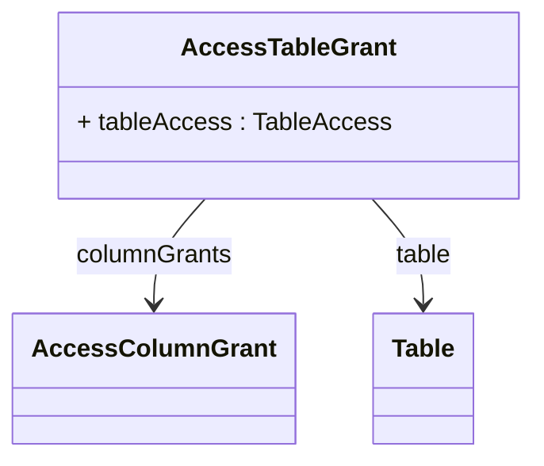

# AccessTableGrant

## Extends

## Attributes

<table>
  <thead>
    <tr>
      <th>Name</th>
      <th>Id</th>
      <th>Typ</th>
      <th>Lower</th>
      <th>Upper</th>
    </tr>
  </thead>
  <tbody>
    <tr>
      <td><strong>tableAccess</strong></td>
      <td>false</td>
      <td><em>TableAccess<a href="./enum-TableAccess">🔗</a></em></td>
      <td>1</td>
      <td>1</td>
    </tr>
    <tr>
      <td colspan="5"><em> here you will see the description.</em></td>
    </tr>
  </tbody>
</table>

## References

<table>
  <thead>
    <tr>
      <th>Name</th>
      <th>Typ</th>
      <th>Lower</th>
      <th>Upper</th>
      <th>Containment</th>
    </tr>
  </thead>
  <tbody>
    <tr>
      <td><strong>columnGrants</strong></td>
      <td>AccessColumnGrant<a href="./class-AccessColumnGrant">🔗</a></td>
      <td>1</td>
      <td>&infin;</td>
      <td>true</td>
    </tr>
    <tr>
      <td colspan="5"><em> here you will see the description.</em></td>
    </tr>
    <tr>
      <td><strong>table</strong></td>
      <td>Table<a href="./class-Table">🔗</a></td>
      <td>1</td>
      <td>1</td>
      <td>false</td>
    </tr>
    <tr>
      <td colspan="5"><em> here you will see the description.</em></td>
    </tr>
  </tbody>
</table>

## Used by

- AccessDatabaseSchemaGrant[🔗](./class-AccessDatabaseSchemaGrant) → tableGrants

## ClassDiagramm

