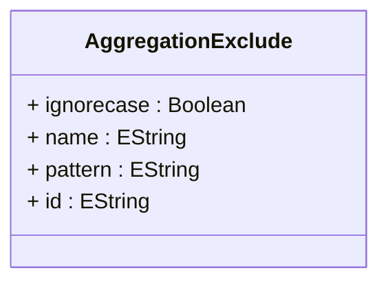

# AggregationExclude

## Extends

## Attributes

<table>
  <thead>
    <tr>
      <th>Name</th>
      <th>Id</th>
      <th>Typ</th>
      <th>Lower</th>
      <th>Upper</th>
    </tr>
  </thead>
  <tbody>
    <tr>
      <td><strong>ignorecase</strong></td>
      <td>false</td>
      <td><em>Boolean</em></td>
      <td>0</td>
      <td>1</td>
    </tr>
    <tr>
      <td colspan="5"><em> here you will see the description.</em></td>
    </tr>
    <tr>
      <td><strong>name</strong></td>
      <td>false</td>
      <td><em>EString</em></td>
      <td>0</td>
      <td>1</td>
    </tr>
    <tr>
      <td colspan="5"><em> here you will see the description.</em></td>
    </tr>
    <tr>
      <td><strong>pattern</strong></td>
      <td>false</td>
      <td><em>EString</em></td>
      <td>0</td>
      <td>1</td>
    </tr>
    <tr>
      <td colspan="5"><em> here you will see the description.</em></td>
    </tr>
    <tr>
      <td><strong>id</strong></td>
      <td>true</td>
      <td><em>EString</em></td>
      <td>1</td>
      <td>1</td>
    </tr>
    <tr>
      <td colspan="5"><em> here you will see the description.</em></td>
    </tr>
  </tbody>
</table>

## References

<table>
  <thead>
    <tr>
      <th>Name</th>
      <th>Typ</th>
      <th>Lower</th>
      <th>Upper</th>
      <th>Containment</th>
    </tr>
  </thead>
  <tbody>
  </tbody>
</table>

## Used by

- Enviroment[🔗](./class-Enviroment) → aggregationExcludes
- TableQuery[🔗](./class-TableQuery) → aggregationExcludes
- AggregationPattern[🔗](./class-AggregationPattern) → excludes

## ClassDiagramm

