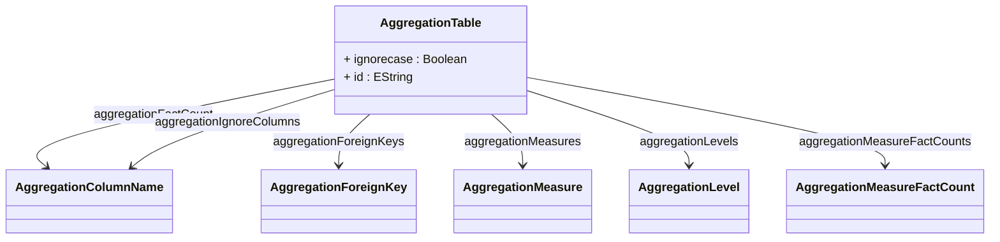

# AggregationTable

## Extends

## Attributes

<table>
  <thead>
    <tr>
      <th>Name</th>
      <th>Id</th>
      <th>Typ</th>
      <th>Lower</th>
      <th>Upper</th>
    </tr>
  </thead>
  <tbody>
    <tr>
      <td><strong>ignorecase</strong></td>
      <td>false</td>
      <td><em>Boolean</em></td>
      <td>0</td>
      <td>1</td>
    </tr>
    <tr>
      <td colspan="5"><em> here you will see the description.</em></td>
    </tr>
    <tr>
      <td><strong>id</strong></td>
      <td>true</td>
      <td><em>EString</em></td>
      <td>1</td>
      <td>1</td>
    </tr>
    <tr>
      <td colspan="5"><em> here you will see the description.</em></td>
    </tr>
  </tbody>
</table>

## References

<table>
  <thead>
    <tr>
      <th>Name</th>
      <th>Typ</th>
      <th>Lower</th>
      <th>Upper</th>
      <th>Containment</th>
    </tr>
  </thead>
  <tbody>
    <tr>
      <td><strong>aggregationFactCount</strong></td>
      <td>AggregationColumnName<a href="./class-AggregationColumnName">🔗</a></td>
      <td>1</td>
      <td>1</td>
      <td>true</td>
    </tr>
    <tr>
      <td colspan="5"><em> here you will see the description.</em></td>
    </tr>
    <tr>
      <td><strong>aggregationIgnoreColumns</strong></td>
      <td>AggregationColumnName<a href="./class-AggregationColumnName">🔗</a></td>
      <td>0</td>
      <td>&infin;</td>
      <td>true</td>
    </tr>
    <tr>
      <td colspan="5"><em> here you will see the description.</em></td>
    </tr>
    <tr>
      <td><strong>aggregationForeignKeys</strong></td>
      <td>AggregationForeignKey<a href="./class-AggregationForeignKey">🔗</a></td>
      <td>0</td>
      <td>&infin;</td>
      <td>true</td>
    </tr>
    <tr>
      <td colspan="5"><em> here you will see the description.</em></td>
    </tr>
    <tr>
      <td><strong>aggregationMeasures</strong></td>
      <td>AggregationMeasure<a href="./class-AggregationMeasure">🔗</a></td>
      <td>1</td>
      <td>&infin;</td>
      <td>true</td>
    </tr>
    <tr>
      <td colspan="5"><em> here you will see the description.</em></td>
    </tr>
    <tr>
      <td><strong>aggregationLevels</strong></td>
      <td>AggregationLevel<a href="./class-AggregationLevel">🔗</a></td>
      <td>0</td>
      <td>&infin;</td>
      <td>true</td>
    </tr>
    <tr>
      <td colspan="5"><em> here you will see the description.</em></td>
    </tr>
    <tr>
      <td><strong>aggregationMeasureFactCounts</strong></td>
      <td>AggregationMeasureFactCount<a href="./class-AggregationMeasureFactCount">🔗</a></td>
      <td>0</td>
      <td>&infin;</td>
      <td>true</td>
    </tr>
    <tr>
      <td colspan="5"><em> here you will see the description.</em></td>
    </tr>
  </tbody>
</table>

## Used by

- Enviroment[🔗](./class-Enviroment) → aggregationTables
- TableQuery[🔗](./class-TableQuery) → aggregationTables

## ClassDiagramm

