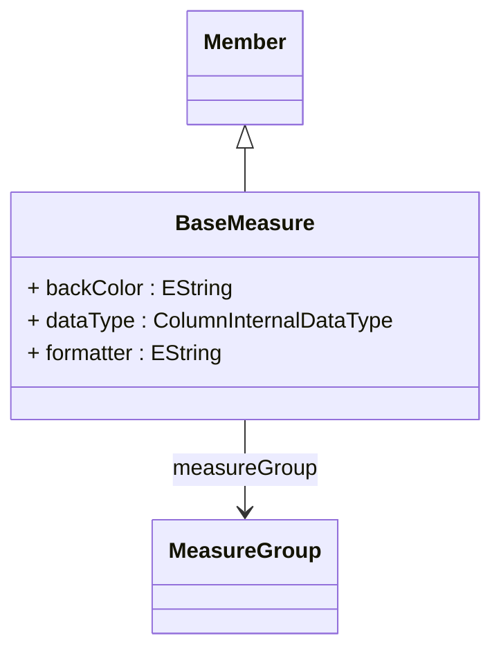

# BaseMeasure

## Extends
- Member [🔗](./class-Member)
## Attributes

<table>
  <thead>
    <tr>
      <th>Name</th>
      <th>Id</th>
      <th>Typ</th>
      <th>Lower</th>
      <th>Upper</th>
    </tr>
  </thead>
  <tbody>
    <tr>
      <td><strong>backColor</strong></td>
      <td>false</td>
      <td><em>EString</em></td>
      <td>0</td>
      <td>1</td>
    </tr>
    <tr>
      <td colspan="5"><em> here you will see the description.</em></td>
    </tr>
    <tr>
      <td><strong>dataType</strong></td>
      <td>false</td>
      <td><em>ColumnInternalDataType<a href="./enum-ColumnInternalDataType">🔗</a></em></td>
      <td>0</td>
      <td>1</td>
    </tr>
    <tr>
      <td colspan="5"><em> here you will see the description.</em></td>
    </tr>
    <tr>
      <td><strong>formatter</strong></td>
      <td>false</td>
      <td><em>EString</em></td>
      <td>0</td>
      <td>1</td>
    </tr>
    <tr>
      <td colspan="5"><em> here you will see the description.</em></td>
    </tr>
  </tbody>
</table>

## References

<table>
  <thead>
    <tr>
      <th>Name</th>
      <th>Typ</th>
      <th>Lower</th>
      <th>Upper</th>
      <th>Containment</th>
    </tr>
  </thead>
  <tbody>
    <tr>
      <td><strong>measureGroup</strong></td>
      <td>MeasureGroup<a href="./class-MeasureGroup">🔗</a></td>
      <td>1</td>
      <td>1</td>
      <td>false</td>
    </tr>
    <tr>
      <td colspan="5"><em> here you will see the description.</em></td>
    </tr>
  </tbody>
</table>

## Used by

- VirtualCube[🔗](./class-VirtualCube) → referencedMeasures
- MeasureGroup[🔗](./class-MeasureGroup) → measures
- DrillThroughAction[🔗](./class-DrillThroughAction) → drillThroughMeasure

## ClassDiagramm

