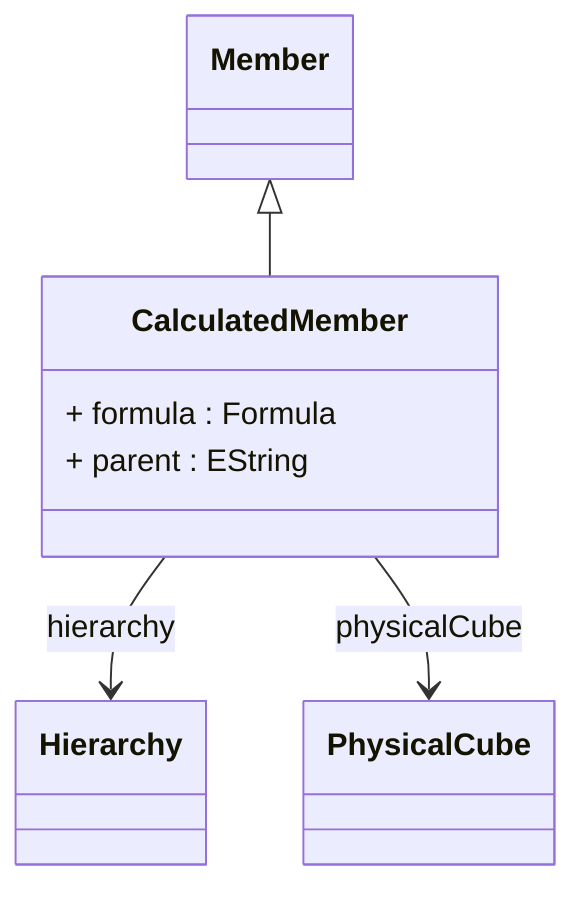

# CalculatedMember

## Extends
- Member [🔗](./class-Member)
## Attributes

<table>
  <thead>
    <tr>
      <th>Name</th>
      <th>Id</th>
      <th>Typ</th>
      <th>Lower</th>
      <th>Upper</th>
    </tr>
  </thead>
  <tbody>
    <tr>
      <td><strong>formula</strong></td>
      <td>false</td>
      <td><em>Formula</em></td>
      <td>0</td>
      <td>1</td>
    </tr>
    <tr>
      <td colspan="5"><em> here you will see the description.</em></td>
    </tr>
    <tr>
      <td><strong>parent</strong></td>
      <td>false</td>
      <td><em>EString</em></td>
      <td>0</td>
      <td>1</td>
    </tr>
    <tr>
      <td colspan="5"><em> here you will see the description.</em></td>
    </tr>
  </tbody>
</table>

## References

<table>
  <thead>
    <tr>
      <th>Name</th>
      <th>Typ</th>
      <th>Lower</th>
      <th>Upper</th>
      <th>Containment</th>
    </tr>
  </thead>
  <tbody>
    <tr>
      <td><strong>hierarchy</strong></td>
      <td>Hierarchy<a href="./class-Hierarchy">🔗</a></td>
      <td>0</td>
      <td>1</td>
      <td>false</td>
    </tr>
    <tr>
      <td colspan="5"><em> here you will see the description.</em></td>
    </tr>
    <tr>
      <td><strong>physicalCube</strong></td>
      <td>PhysicalCube<a href="./class-PhysicalCube">🔗</a></td>
      <td>1</td>
      <td>1</td>
      <td>false</td>
    </tr>
    <tr>
      <td colspan="5"><em> here you will see the description.</em></td>
    </tr>
  </tbody>
</table>

## Used by

- Cube[🔗](./class-Cube) → calculatedMembers
- VirtualCube[🔗](./class-VirtualCube) → referencedCalculatedMembers

## ClassDiagramm

