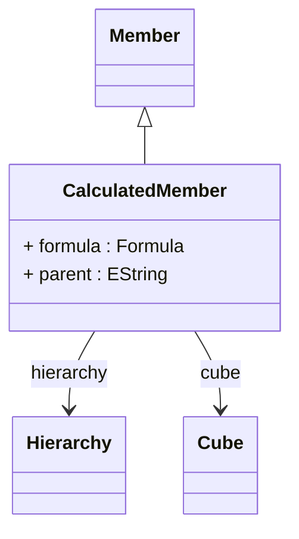

# CalculatedMember

Represents sophisticated computed members that are dynamically calculated using MDX expressions, enabling powerful analytical capabilities including complex business logic, mathematical computations, conditional calculations, and cross-dimensional analysis that extend far beyond the capabilities of standard dimensional members stored in database tables. CalculatedMember provides the foundation for advanced analytical modeling where business requirements necessitate dynamic member creation based on complex formulas, business rules, or computational logic that cannot be pre-calculated and stored in traditional dimensional tables.
## Extends
- Member [🔗](./class-Member)
## Attributes

<table>
  <thead>
    <tr>
      <th>Name</th>
      <th>Id</th>
      <th>Type</th>
      <th>Lower</th>
      <th>Upper</th>
      <th>Default</th>
    </tr>
  </thead>
  <tbody>
    <tr>
      <td><strong>formula</strong></td>
      <td>false</td>
      <td><em>Formula</em></td>
      <td>0</td>
      <td>1</td>
      <td></td>
    </tr>
    <tr>
      <td colspan="6"><em>MDX expression that defines the calculation logic for this computed member, encapsulating sophisticated business rules, mathematical formulations, and analytical computations that determine the member's value based on other measures, members, and dimensional context. The formula serves as the computational heart of the calculated member, enabling complex analytical scenarios including financial ratio calculations that combine multiple measures with mathematical operations, time-based calculations that implement period-over-period comparisons and trend analysis, conditional logic that applies different calculation rules based on dimensional attributes or member properties, and cross-dimensional calculations that aggregate or transform data across multiple analytical perspectives.</em></td>
    </tr>
    <tr>
      <td><strong>parent</strong></td>
      <td>false</td>
      <td><em>EString</em></td>
      <td>0</td>
      <td>1</td>
      <td></td>
    </tr>
    <tr>
      <td colspan="6"><em>MDX expression that identifies the parent member within the dimensional hierarchy where this calculated member should be positioned, establishing the hierarchical context and navigational placement that determines how the calculated member appears in dimensional browsers, OLAP client tools, and analytical applications. The parent specification enables sophisticated calculated member organization where computed members can be logically grouped with related dimensional concepts, positioned at appropriate hierarchical levels for intuitive user navigation, and integrated seamlessly with existing dimensional structures to provide cohesive analytical experiences.</em></td>
    </tr>
  </tbody>
</table>

## References

<table>
  <thead>
    <tr>
      <th>Name</th>
      <th>Type</th>
      <th>Lower</th>
      <th>Upper</th>
      <th>Containment</th>
    </tr>
  </thead>
  <tbody>
    <tr>
      <td><strong>hierarchy</strong></td>
      <td>Hierarchy<a href="./class-Hierarchy">🔗</a></td>
      <td>0</td>
      <td>1</td>
      <td>false</td>
    </tr>
    <tr>
      <td colspan="5"><em>Reference to the Hierarchy within which this calculated member should be positioned, establishing the dimensional context that determines the member's analytical scope, navigational placement, and integration with existing hierarchical structures. The hierarchy reference defines the analytical domain where the calculated member will be available for selection, filtering, and navigation operations, ensuring that computed members integrate seamlessly with dimensional browsing, member selection, and hierarchical drill-down capabilities provided by OLAP client applications and business intelligence tools.</em></td>
    </tr>
    <tr>
      <td><strong>cube</strong></td>
      <td>Cube<a href="./class-Cube">🔗</a></td>
      <td>1</td>
      <td>1</td>
      <td>false</td>
    </tr>
    <tr>
      <td colspan="5"><em>Required reference to the Cube that contains and manages this calculated member, establishing the analytical context and data scope within which the calculated member operates and ensuring proper integration with the cube's dimensional structure, measure definitions, and query processing capabilities. The cube reference defines the analytical environment where the calculated member can access fact data, reference other measures and members, and participate in multidimensional analysis operations including slicing, dicing, drilling, and pivoting across the cube's dimensional space.</em></td>
    </tr>
  </tbody>
</table>

## Used by

- Cube[🔗](./class-Cube) → calculatedMembers
- VirtualCube[🔗](./class-VirtualCube) → referencedCalculatedMembers

## ClassDiagramm

