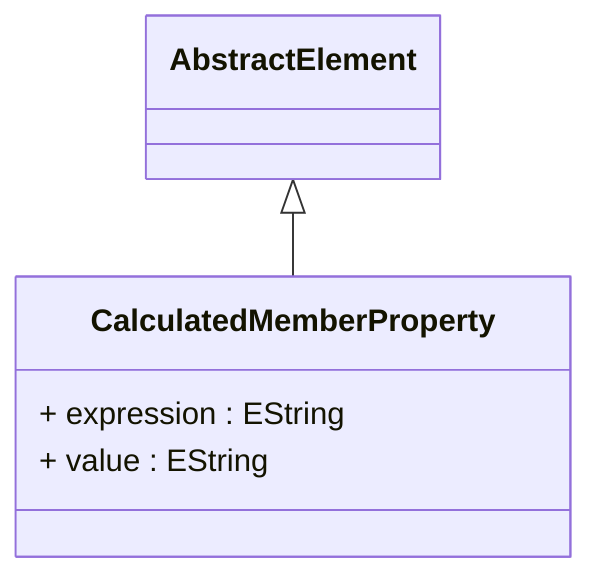

# CalculatedMemberProperty

Defines additional metadata properties and behavioral characteristics for calculated members, providing sophisticated customization capabilities that control how computed members appear, behave, and integrate within analytical applications and business intelligence tools. CalculatedMemberProperty enables advanced calculated member configuration where computed members can be enhanced with specialized attributes, formatting rules, display characteristics, and behavioral modifiers that optimize their presentation and functionality within different analytical contexts and user interface environments.
## Extends
- AbstractElement [🔗](./class-AbstractElement)
## Attributes

<table>
  <thead>
    <tr>
      <th>Name</th>
      <th>Id</th>
      <th>Type</th>
      <th>Lower</th>
      <th>Upper</th>
      <th>Default</th>
    </tr>
  </thead>
  <tbody>
    <tr>
      <td><strong>expression</strong></td>
      <td>false</td>
      <td><em>EString</em></td>
      <td>0</td>
      <td>1</td>
      <td></td>
    </tr>
    <tr>
      <td colspan="6"><em>MDX expression that dynamically calculates the value of this calculated member property based on analytical context, dimensional relationships, and computational logic that can adapt to different query scenarios and data conditions. The expression provides sophisticated property value determination where calculated member properties can be computed based on current member context, related dimensional attributes, measure values, and complex business rules that reflect organizational policies and analytical requirements.</em></td>
    </tr>
    <tr>
      <td><strong>value</strong></td>
      <td>false</td>
      <td><em>EString</em></td>
      <td>0</td>
      <td>1</td>
      <td></td>
    </tr>
    <tr>
      <td colspan="6"><em>Static string value for this calculated member property when dynamic expression evaluation is not required, providing a simple and efficient mechanism for setting fixed property values that do not change based on analytical context or computational logic. The static value approach is optimal for calculated member properties that have predetermined, unchanging characteristics such as fixed formatting specifications, constant display attributes, static descriptive text, or invariant behavioral flags that apply consistently across all analytical scenarios and usage contexts.</em></td>
    </tr>
  </tbody>
</table>

## References

<table>
  <thead>
    <tr>
      <th>Name</th>
      <th>Type</th>
      <th>Lower</th>
      <th>Upper</th>
      <th>Containment</th>
    </tr>
  </thead>
  <tbody>
  </tbody>
</table>

## Used by

- Member[🔗](./class-Member) → calculatedMemberProperties

## ClassDiagramm

