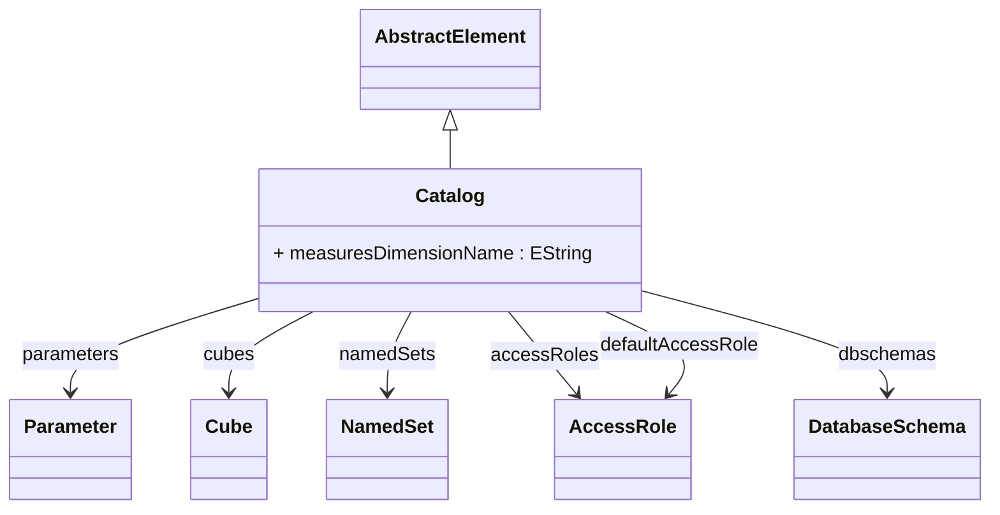

# Catalog

## Extends
- AbstractElement [🔗](./class-AbstractElement)
## Attributes

<table>
  <thead>
    <tr>
      <th>Name</th>
      <th>Id</th>
      <th>Typ</th>
      <th>Lower</th>
      <th>Upper</th>
    </tr>
  </thead>
  <tbody>
    <tr>
      <td><strong>measuresDimensionName</strong></td>
      <td>false</td>
      <td><em>EString</em></td>
      <td>0</td>
      <td>1</td>
    </tr>
    <tr>
      <td colspan="5"><em> here you will see the description.</em></td>
    </tr>
  </tbody>
</table>

## References

<table>
  <thead>
    <tr>
      <th>Name</th>
      <th>Typ</th>
      <th>Lower</th>
      <th>Upper</th>
      <th>Containment</th>
    </tr>
  </thead>
  <tbody>
    <tr>
      <td><strong>parameters</strong></td>
      <td>Parameter<a href="./class-Parameter">🔗</a></td>
      <td>0</td>
      <td>&infin;</td>
      <td>true</td>
    </tr>
    <tr>
      <td colspan="5"><em> here you will see the description.</em></td>
    </tr>
    <tr>
      <td><strong>cubes</strong></td>
      <td>Cube<a href="./class-Cube">🔗</a></td>
      <td>1</td>
      <td>&infin;</td>
      <td>false</td>
    </tr>
    <tr>
      <td colspan="5"><em> here you will see the description.</em></td>
    </tr>
    <tr>
      <td><strong>namedSets</strong></td>
      <td>NamedSet<a href="./class-NamedSet">🔗</a></td>
      <td>0</td>
      <td>&infin;</td>
      <td>false</td>
    </tr>
    <tr>
      <td colspan="5"><em> here you will see the description.</em></td>
    </tr>
    <tr>
      <td><strong>accessRoles</strong></td>
      <td>AccessRole<a href="./class-AccessRole">🔗</a></td>
      <td>0</td>
      <td>&infin;</td>
      <td>false</td>
    </tr>
    <tr>
      <td colspan="5"><em> here you will see the description.</em></td>
    </tr>
    <tr>
      <td><strong>defaultAccessRole</strong></td>
      <td>AccessRole<a href="./class-AccessRole">🔗</a></td>
      <td>0</td>
      <td>1</td>
      <td>false</td>
    </tr>
    <tr>
      <td colspan="5"><em> here you will see the description.</em></td>
    </tr>
    <tr>
      <td><strong>dbschemas</strong></td>
      <td>DatabaseSchema<a href="./class-DatabaseSchema">🔗</a></td>
      <td>0</td>
      <td>&infin;</td>
      <td>false</td>
    </tr>
    <tr>
      <td colspan="5"><em> here you will see the description.</em></td>
    </tr>
  </tbody>
</table>

## Used by

- Enviroment[🔗](./class-Enviroment) → schemas

## ClassDiagramm

