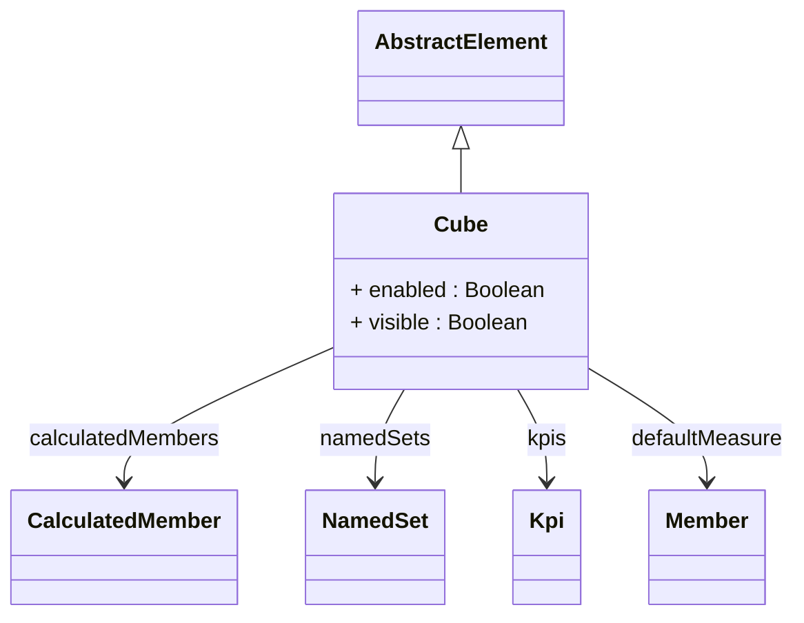

# Cube

## Extends
- AbstractElement [🔗](./class-AbstractElement)
## Attributes

<table>
  <thead>
    <tr>
      <th>Name</th>
      <th>Id</th>
      <th>Typ</th>
      <th>Lower</th>
      <th>Upper</th>
    </tr>
  </thead>
  <tbody>
    <tr>
      <td><strong>enabled</strong></td>
      <td>false</td>
      <td><em>Boolean</em></td>
      <td>0</td>
      <td>1</td>
    </tr>
    <tr>
      <td colspan="5"><em> here you will see the description.</em></td>
    </tr>
    <tr>
      <td><strong>visible</strong></td>
      <td>false</td>
      <td><em>Boolean</em></td>
      <td>0</td>
      <td>1</td>
    </tr>
    <tr>
      <td colspan="5"><em> here you will see the description.</em></td>
    </tr>
  </tbody>
</table>

## References

<table>
  <thead>
    <tr>
      <th>Name</th>
      <th>Typ</th>
      <th>Lower</th>
      <th>Upper</th>
      <th>Containment</th>
    </tr>
  </thead>
  <tbody>
    <tr>
      <td><strong>calculatedMembers</strong></td>
      <td>CalculatedMember<a href="./class-CalculatedMember">🔗</a></td>
      <td>0</td>
      <td>&infin;</td>
      <td>true</td>
    </tr>
    <tr>
      <td colspan="5"><em> here you will see the description.</em></td>
    </tr>
    <tr>
      <td><strong>namedSets</strong></td>
      <td>NamedSet<a href="./class-NamedSet">🔗</a></td>
      <td>0</td>
      <td>&infin;</td>
      <td>true</td>
    </tr>
    <tr>
      <td colspan="5"><em> here you will see the description.</em></td>
    </tr>
    <tr>
      <td><strong>kpis</strong></td>
      <td>Kpi<a href="./class-Kpi">🔗</a></td>
      <td>0</td>
      <td>&infin;</td>
      <td>true</td>
    </tr>
    <tr>
      <td colspan="5"><em> here you will see the description.</em></td>
    </tr>
    <tr>
      <td><strong>defaultMeasure</strong></td>
      <td>Member<a href="./class-Member">🔗</a></td>
      <td>0</td>
      <td>1</td>
      <td>false</td>
    </tr>
    <tr>
      <td colspan="5"><em> here you will see the description.</em></td>
    </tr>
  </tbody>
</table>

## Used by

- Enviroment[🔗](./class-Enviroment) → cubes
- Catalog[🔗](./class-Catalog) → cubes
- CubeConnector[🔗](./class-CubeConnector) → cube
- AccessCubeGrant[🔗](./class-AccessCubeGrant) → cube

## ClassDiagramm

