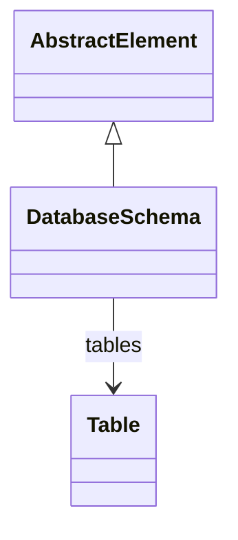

# DatabaseSchema

## Extends
- AbstractElement [🔗](./class-AbstractElement)
## Attributes

<table>
  <thead>
    <tr>
      <th>Name</th>
      <th>Id</th>
      <th>Typ</th>
      <th>Lower</th>
      <th>Upper</th>
    </tr>
  </thead>
  <tbody>
  </tbody>
</table>

## References

<table>
  <thead>
    <tr>
      <th>Name</th>
      <th>Typ</th>
      <th>Lower</th>
      <th>Upper</th>
      <th>Containment</th>
    </tr>
  </thead>
  <tbody>
    <tr>
      <td><strong>tables</strong></td>
      <td>Table<a href="./class-Table">🔗</a></td>
      <td>0</td>
      <td>&infin;</td>
      <td>true</td>
    </tr>
    <tr>
      <td colspan="5"><em> here you will see the description.</em></td>
    </tr>
  </tbody>
</table>

## Used by

- Catalog[🔗](./class-Catalog) → dbschemas
- AccessDatabaseSchemaGrant[🔗](./class-AccessDatabaseSchemaGrant) → databaseSchema
- DatabaseCatalog[🔗](./class-DatabaseCatalog) → schemas
- Table[🔗](./class-Table) → schema

## ClassDiagramm

