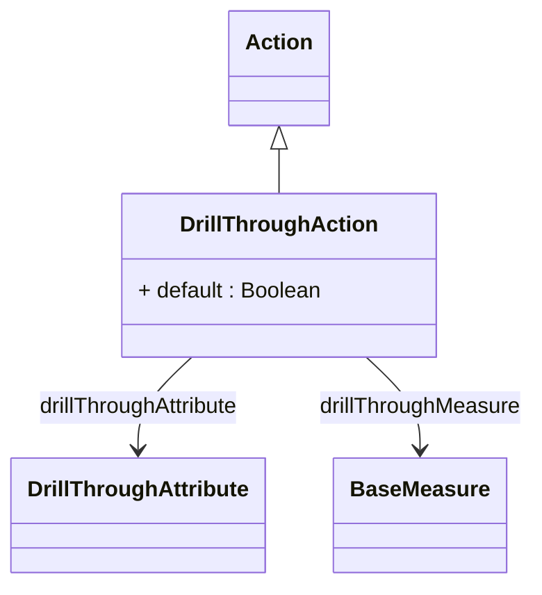

# DrillThroughAction

Specialized action that enables users to drill through from aggregated analytical views to the underlying detailed transaction data that contributed to specific measure values, providing powerful capabilities for data exploration, validation, and detailed investigation of analytical results. DrillThroughAction represents one of the most valuable interactive features in modern OLAP applications, enabling users to seamlessly transition from high-level analytical summaries to detailed operational data without losing analytical context or requiring technical knowledge of underlying data structures.
## Extends
- Action [🔗](./class-Action)
## Attributes

<table>
  <thead>
    <tr>
      <th>Name</th>
      <th>Id</th>
      <th>Type</th>
      <th>Lower</th>
      <th>Upper</th>
      <th>Default</th>
    </tr>
  </thead>
  <tbody>
    <tr>
      <td><strong>default</strong></td>
      <td>false</td>
      <td><em>Boolean</em></td>
      <td>0</td>
      <td>1</td>
      <td>false</td>
    </tr>
    <tr>
      <td colspan="6"><em>Boolean flag indicating whether this drill-through action serves as the default drill-through operation for the associated analytical context, automatically invoked when users perform standard drill-through gestures without explicitly selecting a specific drill-through action. The default setting enables intuitive user experiences where common drill-through operations are immediately accessible through standard user interface interactions such as double-clicking on measure values, right-click context menus, or dedicated drill-through buttons, while still allowing multiple specialized drill-through actions to be available for advanced scenarios.</em></td>
    </tr>
  </tbody>
</table>

## References

<table>
  <thead>
    <tr>
      <th>Name</th>
      <th>Type</th>
      <th>Lower</th>
      <th>Upper</th>
      <th>Containment</th>
    </tr>
  </thead>
  <tbody>
    <tr>
      <td><strong>drillThroughAttribute</strong></td>
      <td>DrillThroughAttribute<a href="./class-DrillThroughAttribute">🔗</a></td>
      <td>0</td>
      <td>&infin;</td>
      <td>true</td>
    </tr>
    <tr>
      <td colspan="5"><em>Collection of DrillThroughAttribute objects that specify which dimensional attributes and descriptive columns should be included in drill-through result sets, providing sophisticated control over the detailed data presentation that enables users to access relevant contextual information alongside transactional data.</em></td>
    </tr>
    <tr>
      <td><strong>drillThroughMeasure</strong></td>
      <td>BaseMeasure<a href="./class-BaseMeasure">🔗</a></td>
      <td>0</td>
      <td>&infin;</td>
      <td>false</td>
    </tr>
    <tr>
      <td colspan="5"><em>Collection of BaseMeasure references that specify which measures should be included in drill-through result sets, enabling sophisticated control over the quantitative data presentation that provides users with relevant numeric context alongside detailed transactional information.</em></td>
    </tr>
  </tbody>
</table>

## Used by

## ClassDiagramm

