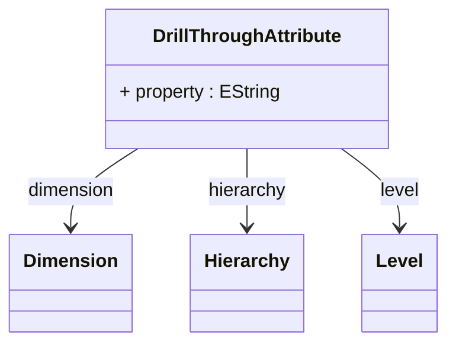

# DrillThroughAttribute

Defines a dimensional attribute or member property that should be included in drill-through result sets, providing sophisticated control over the contextual information that accompanies detailed transactional data when users drill through from aggregated analytical views. DrillThroughAttribute enables rich drill-through experiences where users can access not only the underlying fact data but also relevant dimensional context that provides business meaning and analytical insight into the detailed results.
## Extends

## Attributes

<table>
  <thead>
    <tr>
      <th>Name</th>
      <th>Id</th>
      <th>Type</th>
      <th>Lower</th>
      <th>Upper</th>
    </tr>
  </thead>
  <tbody>
    <tr>
      <td><strong>property</strong></td>
      <td>false</td>
      <td><em>EString</em></td>
      <td>0</td>
      <td>1</td>
    </tr>
    <tr>
      <td colspan="5"><em>Name of the specific member property within the associated dimension or hierarchy that should be included in drill-through result sets, enabling precise selection of individual attribute values that provide meaningful business context for detailed data analysis. The property specification allows drill-through results to include specific member characteristics such as descriptive names, business codes, category classifications, or other dimensional attributes that help users understand and interpret the underlying transactional data within its proper business context.</em></td>
    </tr>
  </tbody>
</table>

## References

<table>
  <thead>
    <tr>
      <th>Name</th>
      <th>Type</th>
      <th>Lower</th>
      <th>Upper</th>
      <th>Containment</th>
    </tr>
  </thead>
  <tbody>
    <tr>
      <td><strong>dimension</strong></td>
      <td>Dimension<a href="./class-Dimension">🔗</a></td>
      <td>1</td>
      <td>1</td>
      <td>false</td>
    </tr>
    <tr>
      <td colspan="5"><em>Required reference to the Dimension that contains the attribute or property to be included in drill-through results, establishing the dimensional context that determines which member attributes are available for inclusion in detailed result sets. The dimension reference defines the analytical domain from which attribute values will be extracted, ensuring that drill-through results can include relevant dimensional context that provides business meaning and interpretive value for the underlying transactional data.</em></td>
    </tr>
    <tr>
      <td><strong>hierarchy</strong></td>
      <td>Hierarchy<a href="./class-Hierarchy">🔗</a></td>
      <td>0</td>
      <td>1</td>
      <td>false</td>
    </tr>
    <tr>
      <td colspan="5"><em>Optional reference to a specific Hierarchy within the associated dimension that narrows the scope of attribute selection, enabling precise control over which hierarchical context should be used when including dimensional attributes in drill-through results.</em></td>
    </tr>
    <tr>
      <td><strong>level</strong></td>
      <td>Level<a href="./class-Level">🔗</a></td>
      <td>0</td>
      <td>1</td>
      <td>false</td>
    </tr>
    <tr>
      <td colspan="5"><em>Optional reference to a specific Level within the associated hierarchy that further refines the granularity of attribute selection, enabling precise control over which hierarchical level should provide the attribute values for drill-through results.</em></td>
    </tr>
  </tbody>
</table>

## Used by

- DrillThroughAction[🔗](./class-DrillThroughAction) → drillThroughAttribute

## ClassDiagramm

