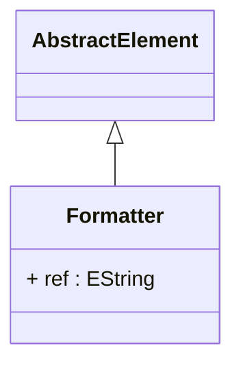

# Formatter

Abstract base class for sophisticated display formatting components that control how analytical values, dimensional members, and other OLAP elements are presented to users in client applications, reports, and dashboards.
## Extends
- AbstractElement [🔗](./class-AbstractElement)
## Attributes

<table>
  <thead>
    <tr>
      <th>Name</th>
      <th>Id</th>
      <th>Type</th>
      <th>Lower</th>
      <th>Upper</th>
    </tr>
  </thead>
  <tbody>
    <tr>
      <td><strong>ref</strong></td>
      <td>false</td>
      <td><em>EString</em></td>
      <td>0</td>
      <td>1</td>
    </tr>
    <tr>
      <td colspan="5"><em>Reference identifier that enables sharing and reuse of formatter definitions across multiple OLAP elements, supporting efficient formatter management and consistent presentation styling throughout analytical applications.</em></td>
    </tr>
  </tbody>
</table>

## References

<table>
  <thead>
    <tr>
      <th>Name</th>
      <th>Type</th>
      <th>Lower</th>
      <th>Upper</th>
      <th>Containment</th>
    </tr>
  </thead>
  <tbody>
  </tbody>
</table>

## Used by

## ClassDiagramm

