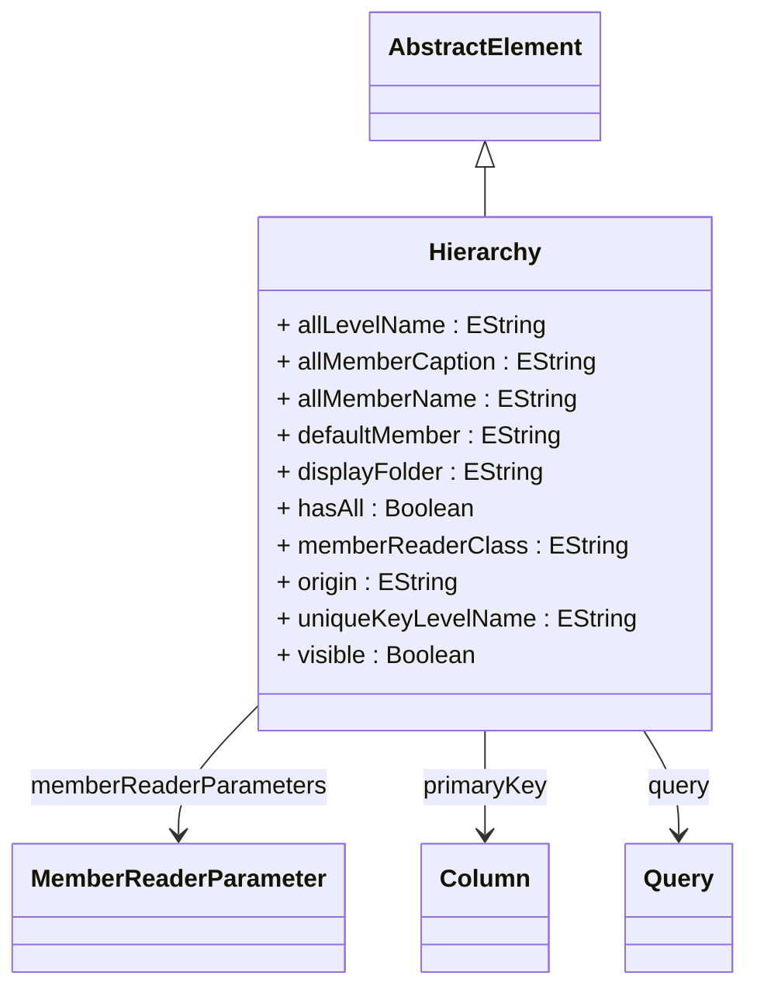

# Hierarchy

Abstract base class for OLAP hierarchies that organize dimension members into structured levels, enabling multidimensional analysis through drill-down, roll-up, and slice-and-dice operations. Hierarchies serve as navigational pathways through dimension data, organizing members from most detailed (leaf) to most aggregated (all member) levels. They support both explicit level-based structures and parent-child self-referencing relationships.
## Extends
- AbstractElement [🔗](./class-AbstractElement)
## Attributes

<table>
  <thead>
    <tr>
      <th>Name</th>
      <th>Id</th>
      <th>Type</th>
      <th>Lower</th>
      <th>Upper</th>
      <th>Default</th>
    </tr>
  </thead>
  <tbody>
    <tr>
      <td><strong>allLevelName</strong></td>
      <td>false</td>
      <td><em>EString</em></td>
      <td>0</td>
      <td>1</td>
      <td></td>
    </tr>
    <tr>
      <td colspan="6"><em>Custom name for the All level when hasAll is true. If not specified, defaults to '(All)'. The All level represents the topmost aggregation level containing the single All member that aggregates all members in the hierarchy.</em></td>
    </tr>
    <tr>
      <td><strong>allMemberCaption</strong></td>
      <td>false</td>
      <td><em>EString</em></td>
      <td>0</td>
      <td>1</td>
      <td></td>
    </tr>
    <tr>
      <td colspan="6"><em>Display caption for the All member that appears in client tools and reports. This provides a user-friendly label that may differ from the internal allMemberName, supporting localization and business-friendly terminology.</em></td>
    </tr>
    <tr>
      <td><strong>allMemberName</strong></td>
      <td>false</td>
      <td><em>EString</em></td>
      <td>0</td>
      <td>1</td>
      <td></td>
    </tr>
    <tr>
      <td colspan="6"><em>Name of the All member when hasAll is true. If not specified, defaults to 'All [HierarchyName]s'. The All member serves as the root aggregation member containing the sum of all members in the hierarchy.</em></td>
    </tr>
    <tr>
      <td><strong>defaultMember</strong></td>
      <td>false</td>
      <td><em>EString</em></td>
      <td>0</td>
      <td>1</td>
      <td></td>
    </tr>
    <tr>
      <td colspan="6"><em>MDX expression identifying the default member used when this hierarchy is referenced in queries without an explicit member selection. If not specified, defaults to the All member (when hasAll=true) or the first member of the first level. This member serves as the implicit context for calculations and filtering.</em></td>
    </tr>
    <tr>
      <td><strong>displayFolder</strong></td>
      <td>false</td>
      <td><em>EString</em></td>
      <td>0</td>
      <td>1</td>
      <td></td>
    </tr>
    <tr>
      <td colspan="6"><em>Optional folder path for organizing this hierarchy in client tool dimension browsers and metadata trees. Supports hierarchical folder structures using forward slashes (e.g., 'Geography/Administrative') to create logical groupings for improved user experience and dimension organization.</em></td>
    </tr>
    <tr>
      <td><strong>hasAll</strong></td>
      <td>false</td>
      <td><em>Boolean</em></td>
      <td>1</td>
      <td>1</td>
      <td>true</td>
    </tr>
    <tr>
      <td colspan="6"><em>Controls whether this hierarchy includes an 'All' level containing a single member that aggregates all other members. When true (default), enables total aggregations and 'grand total' calculations. Time hierarchies often set this to false to prevent meaningless temporal aggregations across all time periods.</em></td>
    </tr>
    <tr>
      <td><strong>memberReaderClass</strong></td>
      <td>false</td>
      <td><em>EString</em></td>
      <td>0</td>
      <td>1</td>
      <td></td>
    </tr>
    <tr>
      <td colspan="6"><em>Fully qualified class name of a custom Java MemberReader implementation for loading hierarchy members. When specified, overrides the default member loading behavior to enable custom data sources, specialized caching strategies, security integration, or advanced member computation logic. The class must implement the MemberReader interface.</em></td>
    </tr>
    <tr>
      <td><strong>origin</strong></td>
      <td>false</td>
      <td><em>EString</em></td>
      <td>0</td>
      <td>1</td>
      <td></td>
    </tr>
    <tr>
      <td colspan="6"><em>Source system identifier indicating the origin of this hierarchy definition. Used for provenance tracking, debugging, and managing hierarchies that originate from multiple source systems or schema generation processes. Helpful for maintaining data lineage in complex multi-source OLAP environments.</em></td>
    </tr>
    <tr>
      <td><strong>uniqueKeyLevelName</strong></td>
      <td>false</td>
      <td><em>EString</em></td>
      <td>0</td>
      <td>1</td>
      <td></td>
    </tr>
    <tr>
      <td colspan="6"><em>Name of the level within this hierarchy that contains unique key values for member identification, establishing the granularity level where member keys become distinct and enabling proper member resolution in MDX queries, drill-through operations, and dimensional navigation scenarios. The unique key level defines the point in the hierarchical structure where member identification transitions from potentially shared keys at higher levels to guaranteed unique identifiers, which is crucial for maintaining data integrity.</em></td>
    </tr>
    <tr>
      <td><strong>visible</strong></td>
      <td>false</td>
      <td><em>Boolean</em></td>
      <td>0</td>
      <td>1</td>
      <td>true</td>
    </tr>
    <tr>
      <td colspan="6"><em>Boolean flag controlling whether this hierarchy appears in client tool hierarchy browsers, XMLA metadata discovery responses, and dimensional navigation interfaces, enabling sophisticated visibility management for hierarchical structures that may need to be hidden from general users while remaining accessible for programmatic access and advanced analytical scenarios. When set to false, the hierarchy becomes invisible to standard user interfaces and metadata enumeration operations but remains fully functional for direct MDX references, programmatic queries, and system-level operations that explicitly reference the hierarchy by name.</em></td>
    </tr>
  </tbody>
</table>

## References

<table>
  <thead>
    <tr>
      <th>Name</th>
      <th>Type</th>
      <th>Lower</th>
      <th>Upper</th>
      <th>Containment</th>
    </tr>
  </thead>
  <tbody>
    <tr>
      <td><strong>memberReaderParameters</strong></td>
      <td>MemberReaderParameter<a href="./class-MemberReaderParameter">🔗</a></td>
      <td>0</td>
      <td>&infin;</td>
      <td>true</td>
    </tr>
    <tr>
      <td colspan="5"><em>Collection of custom parameters passed to the member reader implementation for controlling member loading behavior, caching strategies, and performance optimization. These parameters enable fine-tuning of hierarchy-specific behaviors like prefetch depth, cache size, and custom loading rules.</em></td>
    </tr>
    <tr>
      <td><strong>primaryKey</strong></td>
      <td>Column<a href="./class-Column">🔗</a></td>
      <td>1</td>
      <td>1</td>
      <td>false</td>
    </tr>
    <tr>
      <td colspan="5"><em>Reference to the database column that serves as the primary key for this hierarchy's main dimension table, establishing the unique identifier system that enables proper member identification, hierarchical relationships, and join operations across the dimensional model. The primary key column is fundamental to the hierarchy's data integrity and query performance, providing the basis for all member lookups, parent-child relationships, and cross-dimensional joins that enable multidimensional analysis.</em></td>
    </tr>
    <tr>
      <td><strong>query</strong></td>
      <td>Query<a href="./class-Query">🔗</a></td>
      <td>0</td>
      <td>1</td>
      <td>false</td>
    </tr>
    <tr>
      <td colspan="5"><em>Reference to the Query object that defines how hierarchy members are retrieved from the underlying data source, specifying the SQL logic, table relationships, and data transformation rules required to populate this hierarchy with members from the dimensional database structures. The query reference establishes the critical link between the logical hierarchy definition and the physical data sources, enabling sophisticated data integration scenarios where hierarchy members may be sourced from complex table joins, views, stored procedures, or federated data sources. </em></td>
    </tr>
  </tbody>
</table>

## Used by

- Dimension[🔗](./class-Dimension) → hierarchies
- Dimension[🔗](./class-Dimension) → defaultHierarchy
- CalculatedMember[🔗](./class-CalculatedMember) → hierarchy
- DrillThroughAttribute[🔗](./class-DrillThroughAttribute) → hierarchy
- AccessHierarchyGrant[🔗](./class-AccessHierarchyGrant) → hierarchy

## ClassDiagramm

