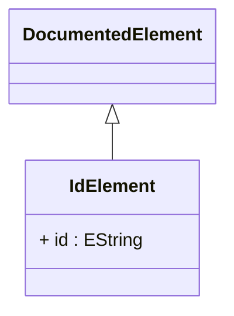

# IdElement

The base class with id in the ROLAP mapping model.
## Extends
- DocumentedElement [🔗](./class-DocumentedElement)
## Attributes

<table>
  <thead>
    <tr>
      <th>Name</th>
      <th>Id</th>
      <th>Type</th>
      <th>Lower</th>
      <th>Upper</th>
      <th>Default</th>
    </tr>
  </thead>
  <tbody>
    <tr>
      <td><strong>id</strong></td>
      <td>true</td>
      <td><em>EString</em></td>
      <td>1</td>
      <td>1</td>
      <td></td>
    </tr>
    <tr>
      <td colspan="6"><em>Unique identifier for this element within the scope of its containing model. This ID serves as the primary key for object references, cross-references between elements, and internal system operations. The ID must be unique and eigther should follow consistent naming conventions (e.g., '_cube_sales', '_dim_product'),or may uses UUIDs. This identifier is used by the OLAP engine for object lookup, caching keys, and maintaining referential integrity during schema transformations.</em></td>
    </tr>
  </tbody>
</table>

## References

<table>
  <thead>
    <tr>
      <th>Name</th>
      <th>Type</th>
      <th>Lower</th>
      <th>Upper</th>
      <th>Containment</th>
    </tr>
  </thead>
  <tbody>
  </tbody>
</table>

## Used by

## ClassDiagramm

