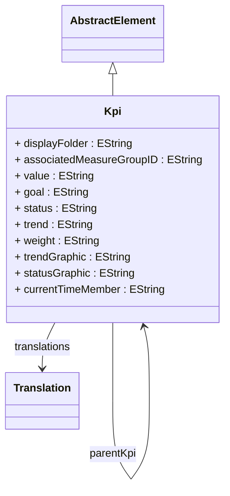

# Kpi

Defines a Key Performance Indicator (KPI) that provides sophisticated business performance monitoring capabilities by combining multiple analytical expressions with visual indicators, targets, and trend analysis to deliver executive-level business intelligence insights. KPI represents a high-level business monitoring construct that transforms raw analytical data into actionable business intelligence by evaluating performance against strategic goals, visualizing trends and status through graphical indicators, and providing contextual information that enables rapid decision-making at executive and management levels.
## Extends
- AbstractElement [🔗](./class-AbstractElement)
## Attributes

<table>
  <thead>
    <tr>
      <th>Name</th>
      <th>Id</th>
      <th>Type</th>
      <th>Lower</th>
      <th>Upper</th>
    </tr>
  </thead>
  <tbody>
    <tr>
      <td><strong>displayFolder</strong></td>
      <td>false</td>
      <td><em>EString</em></td>
      <td>0</td>
      <td>1</td>
    </tr>
    <tr>
      <td colspan="5"><em>Organizational folder path that controls the hierarchical display and categorization of this KPI within business intelligence client tools, OLAP browsers, and executive dashboard applications.</em></td>
    </tr>
    <tr>
      <td><strong>associatedMeasureGroupID</strong></td>
      <td>false</td>
      <td><em>EString</em></td>
      <td>0</td>
      <td>1</td>
    </tr>
    <tr>
      <td colspan="5"><em>Identifier reference to the MeasureGroup that provides the primary analytical context and data foundation for this KPI's calculations, establishing the logical connection between the high-level performance indicator and the underlying measures that drive its evaluation. The associated measure group relationship ensures that KPI calculations have access to the appropriate fact data, aggregation tables, and dimensional context necessary for accurate performance evaluation.</em></td>
    </tr>
    <tr>
      <td><strong>value</strong></td>
      <td>false</td>
      <td><em>EString</em></td>
      <td>1</td>
      <td>1</td>
    </tr>
    <tr>
      <td colspan="5"><em>MDX expression or measure reference that defines the primary calculation logic for this KPI's actual performance value, representing the core analytical computation that transforms raw data into meaningful business performance metrics. The value expression must return a numeric result that represents the current state or achievement level of the key performance indicator, serving as the foundation for all KPI evaluations, comparisons, and trend analysis.</em></td>
    </tr>
    <tr>
      <td><strong>goal</strong></td>
      <td>false</td>
      <td><em>EString</em></td>
      <td>0</td>
      <td>1</td>
    </tr>
    <tr>
      <td colspan="5"><em>MDX expression or static value that defines the target or desired performance level for this KPI, establishing the benchmark against which actual performance is evaluated to determine success, variance, and performance status indicators. The goal expression provides the critical reference point that enables meaningful KPI analysis by defining what constitutes successful performance, acceptable thresholds, and strategic objectives that drive business decision-making and performance management initiatives.</em></td>
    </tr>
    <tr>
      <td><strong>status</strong></td>
      <td>false</td>
      <td><em>EString</em></td>
      <td>0</td>
      <td>1</td>
    </tr>
    <tr>
      <td colspan="5"><em>MDX expression that evaluates the current performance status of this KPI by comparing the actual value against the goal and returning a status indicator that can be used to drive visual representations such as traffic light indicators, performance gauges, and dashboard alerts. The status expression typically returns numeric values that correspond to predefined status levels (e.g., -1 for poor, 0 for acceptable, 1 for good) that can be mapped to visual indicators like red, yellow, and green colors in dashboard displays.</em></td>
    </tr>
    <tr>
      <td><strong>trend</strong></td>
      <td>false</td>
      <td><em>EString</em></td>
      <td>0</td>
      <td>1</td>
    </tr>
    <tr>
      <td colspan="5"><em>MDX expression that evaluates the directional trend of this KPI's performance over time, providing analytical insight into whether performance is improving, declining, or remaining stable relative to historical patterns and business cycles. The trend expression typically returns numeric values that represent trend direction and magnitude (e.g., -1 for declining, 0 for stable, 1 for improving) that can be visualized through trend arrows, slope indicators, and momentum gauges in executive dashboards and performance monitoring applications.</em></td>
    </tr>
    <tr>
      <td><strong>weight</strong></td>
      <td>false</td>
      <td><em>EString</em></td>
      <td>0</td>
      <td>1</td>
    </tr>
    <tr>
      <td colspan="5"><em>Numeric expression that defines the relative importance or weighting factor of this KPI within composite performance assessments, balanced scorecards, and hierarchical KPI structures where multiple performance indicators are combined into unified performance evaluations.</em></td>
    </tr>
    <tr>
      <td><strong>trendGraphic</strong></td>
      <td>false</td>
      <td><em>EString</em></td>
      <td>0</td>
      <td>1</td>
    </tr>
    <tr>
      <td colspan="5"><em>Reference to the visual graphic or icon set that represents trend indicators for this KPI in dashboard displays, executive reports, and business intelligence applications. The trend graphic specification enables consistent and intuitive visual representation of KPI trend analysis across different reporting tools and dashboard platforms, supporting user experience consistency and executive comprehension of performance trajectories.</em></td>
    </tr>
    <tr>
      <td><strong>statusGraphic</strong></td>
      <td>false</td>
      <td><em>EString</em></td>
      <td>0</td>
      <td>1</td>
    </tr>
    <tr>
      <td colspan="5"><em>Reference to the visual graphic or icon set that represents status indicators for this KPI in dashboard displays, performance scorecards, and executive reporting applications. The status graphic specification enables consistent and professional visual representation of KPI performance status across different analytical tools and business intelligence platforms, ensuring immediate recognition and interpretation of performance against targets and goals.</em></td>
    </tr>
    <tr>
      <td><strong>currentTimeMember</strong></td>
      <td>false</td>
      <td><em>EString</em></td>
      <td>0</td>
      <td>1</td>
    </tr>
    <tr>
      <td colspan="5"><em>Reference to the specific time dimension member that represents the temporal context for evaluating KPI calculations and temporal analysis scenarios. This attribute enables time-aware KPI evaluation where calculations are performed relative to a specific point in time or temporal context, supporting sophisticated time-based performance analysis and temporal comparative reporting across different time periods, business cycles, and strategic planning horizons.</em></td>
    </tr>
  </tbody>
</table>

## References

<table>
  <thead>
    <tr>
      <th>Name</th>
      <th>Type</th>
      <th>Lower</th>
      <th>Upper</th>
      <th>Containment</th>
    </tr>
  </thead>
  <tbody>
    <tr>
      <td><strong>translations</strong></td>
      <td>Translation<a href="./class-Translation">🔗</a></td>
      <td>0</td>
      <td>&infin;</td>
      <td>true</td>
    </tr>
    <tr>
      <td colspan="5"><em>Collection of Translation objects that provide localized names, descriptions, and captions for this KPI across different languages and cultural contexts, enabling global deployment of business intelligence dashboards with culturally appropriate KPI representations.</em></td>
    </tr>
    <tr>
      <td><strong>parentKpi</strong></td>
      <td>Kpi<a href="./class-Kpi">🔗</a></td>
      <td>0</td>
      <td>1</td>
      <td>false</td>
    </tr>
    <tr>
      <td colspan="5"><em>Reference to the parent KPI in hierarchical KPI structures that enables composite performance measurement through nested KPI relationships. This association supports sophisticated performance management scenarios where complex business objectives are decomposed into hierarchical performance indicators, enabling drill-down analysis from strategic organizational KPIs to tactical departmental metrics and operational performance measures.</em></td>
    </tr>
  </tbody>
</table>

## Used by

- Cube[🔗](./class-Cube) → kpis

## ClassDiagramm

