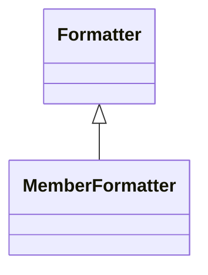

# MemberFormatter

Specialized formatter for controlling how dimensional members are displayed in hierarchical browsers, filter lists, axis labels, and other dimensional navigation interfaces, enabling sophisticated member presentation that can include custom naming schemes, contextual information, visual indicators, and hierarchical styling that enhances dimensional navigation and member selection experiences.
## Extends
- Formatter [🔗](./class-Formatter)
## Attributes

<table>
  <thead>
    <tr>
      <th>Name</th>
      <th>Id</th>
      <th>Type</th>
      <th>Lower</th>
      <th>Upper</th>
    </tr>
  </thead>
  <tbody>
  </tbody>
</table>

## References

<table>
  <thead>
    <tr>
      <th>Name</th>
      <th>Type</th>
      <th>Lower</th>
      <th>Upper</th>
      <th>Containment</th>
    </tr>
  </thead>
  <tbody>
  </tbody>
</table>

## Used by

- Level[🔗](./class-Level) → memberFormatter

## ClassDiagramm

