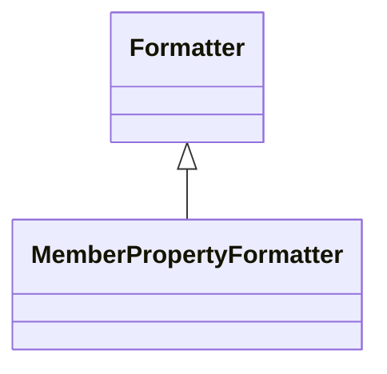

# MemberPropertyFormatter

Specialized formatter for controlling the presentation of member properties in dimensional browsers, tooltip displays, drill-through results, and other contexts where additional member attributes need to be presented in user-friendly, contextually appropriate formats.
## Extends
- Formatter [🔗](./class-Formatter)
## Attributes

<table>
  <thead>
    <tr>
      <th>Name</th>
      <th>Id</th>
      <th>Type</th>
      <th>Lower</th>
      <th>Upper</th>
      <th>Default</th>
    </tr>
  </thead>
  <tbody>
  </tbody>
</table>

## References

<table>
  <thead>
    <tr>
      <th>Name</th>
      <th>Type</th>
      <th>Lower</th>
      <th>Upper</th>
      <th>Containment</th>
    </tr>
  </thead>
  <tbody>
  </tbody>
</table>

## Used by

- MemberProperty[🔗](./class-MemberProperty) → formatter

## ClassDiagramm

