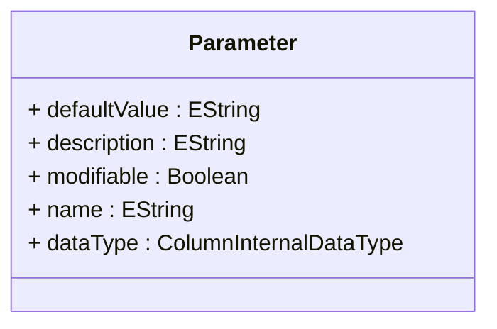

# Parameter

Defines a parameterized input mechanism that enables dynamic, user-driven customization of analytical queries, calculated members, and other OLAP expressions, providing sophisticated capabilities for creating flexible, interactive analytical applications that can adapt to user preferences and changing business requirements.
## Extends

## Attributes

<table>
  <thead>
    <tr>
      <th>Name</th>
      <th>Id</th>
      <th>Type</th>
      <th>Lower</th>
      <th>Upper</th>
    </tr>
  </thead>
  <tbody>
    <tr>
      <td><strong>defaultValue</strong></td>
      <td>false</td>
      <td><em>EString</em></td>
      <td>0</td>
      <td>1</td>
    </tr>
    <tr>
      <td colspan="5"><em>Default parameter value that is automatically applied when users do not explicitly specify a parameter value, ensuring that parameterized analytical applications function correctly and provide meaningful results even when parameters are not explicitly set by end users.</em></td>
    </tr>
    <tr>
      <td><strong>description</strong></td>
      <td>false</td>
      <td><em>EString</em></td>
      <td>0</td>
      <td>1</td>
    </tr>
    <tr>
      <td colspan="5"><em>Detailed explanatory text that describes the parameter's purpose, expected values, impact on analytical results, and usage guidelines, providing essential user guidance that enables effective parameter utilization in self-service analytical applications.</em></td>
    </tr>
    <tr>
      <td><strong>modifiable</strong></td>
      <td>false</td>
      <td><em>Boolean</em></td>
      <td>0</td>
      <td>1</td>
    </tr>
    <tr>
      <td colspan="5"><em>Boolean flag controlling whether end users can modify this parameter's value through client interfaces, enabling sophisticated parameter governance scenarios where certain parameters can be locked to maintain analytical consistency, security, or compliance requirements while still allowing user customization of other parameters</em></td>
    </tr>
    <tr>
      <td><strong>name</strong></td>
      <td>false</td>
      <td><em>EString</em></td>
      <td>1</td>
      <td>1</td>
    </tr>
    <tr>
      <td colspan="5"><em>Unique identifier for this parameter that serves as both the technical reference used in MDX expressions and calculated members, and the basis for user-facing parameter labels in client applications and analytical interfaces.</em></td>
    </tr>
    <tr>
      <td><strong>dataType</strong></td>
      <td>false</td>
      <td><em>ColumnInternalDataType<a href="./enum-ColumnInternalDataType">🔗</a></em></td>
      <td>1</td>
      <td>1</td>
    </tr>
    <tr>
      <td colspan="5"><em>Data type specification that defines the expected format and validation requirements for parameter values, ensuring type safety, input validation, and appropriate client interface generation for parameter entry and manipulation. The data type establishes the fundamental parameter characteristics that determine how parameter values are processed, validated, and integrated into analytical calculations, supporting sophisticated parameter systems where type-specific behavior enables optimal user experiences and analytical accuracy.</em></td>
    </tr>
  </tbody>
</table>

## References

<table>
  <thead>
    <tr>
      <th>Name</th>
      <th>Type</th>
      <th>Lower</th>
      <th>Upper</th>
      <th>Containment</th>
    </tr>
  </thead>
  <tbody>
  </tbody>
</table>

## Used by

- Catalog[🔗](./class-Catalog) → parameters

## ClassDiagramm

