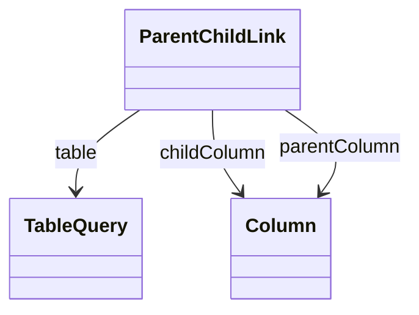

# ParentChildLink

Defines closure table configuration for parent-child hierarchies that dramatically improves query performance by pre-computing and storing all ancestor-descendant relationships in a separate table structure, enabling efficient recursive queries and aggregations without requiring complex recursive SQL operations.

## Attributes

<table>
  <thead>
    <tr>
      <th>Name</th>
      <th>Id</th>
      <th>Type</th>
      <th>Lower</th>
      <th>Upper</th>
      <th>Default</th>
    </tr>
  </thead>
  <tbody>
  </tbody>
</table>

## References

<table>
  <thead>
    <tr>
      <th>Name</th>
      <th>Type</th>
      <th>Lower</th>
      <th>Upper</th>
      <th>Containment</th>
    </tr>
  </thead>
  <tbody>
    <tr>
      <td><strong>table</strong></td>
      <td>TableQuery<a href="./class-TableQuery">🔗</a></td>
      <td>1</td>
      <td>1</td>
      <td>true</td>
    </tr>
    <tr>
      <td colspan="5"><em>Reference to the TableQuery that defines the closure table structure used to store pre-computed ancestor-descendant relationships for this parent-child hierarchy, establishing the physical database table that contains the materialized hierarchical relationships necessary for efficient parent-child operations. The closure table represents a critical performance optimization strategy where all possible ancestor-descendant pairs are pre-calculated and stored in a dedicated table structure, enabling complex hierarchical queries and aggregations to be executed using simple SQL joins rather than expensive recursive operations.</em></td>
    </tr>
    <tr>
      <td><strong>childColumn</strong></td>
      <td>Column<a href="./class-Column">🔗</a></td>
      <td>1</td>
      <td>1</td>
      <td>false</td>
    </tr>
    <tr>
      <td colspan="5"><em>Reference to the database column in the closure table that stores the child member identifier in each ancestor-descendant relationship record, representing the descendant side of the hierarchical relationship and enabling efficient identification of all members that are children, grandchildren, or deeper descendants of any given parent member.</em></td>
    </tr>
    <tr>
      <td><strong>parentColumn</strong></td>
      <td>Column<a href="./class-Column">🔗</a></td>
      <td>1</td>
      <td>1</td>
      <td>false</td>
    </tr>
    <tr>
      <td colspan="5"><em>Reference to the database column in the closure table that stores the parent member identifier in each ancestor-descendant relationship record, representing the ancestor side of the hierarchical relationship and enabling efficient identification of all members that are parents, grandparents, or higher-level ancestors of any given child member. The parent column complements the child column to create complete ancestor-descendant relationship records that eliminate the need for recursive SQL operations during hierarchical navigation and aggregation processes, providing the foundation for high-performance parent-child analytical operations across complex organizational and taxonomic structures.</em></td>
    </tr>
  </tbody>
</table>

## Used by

- ParentChildHierarchy[🔗](./class-ParentChildHierarchy) → parentChildLink

## ClassDiagramm

