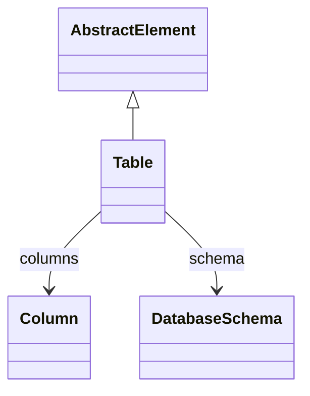

# Table

## Extends
- AbstractElement [🔗](./class-AbstractElement)
## Attributes

<table>
  <thead>
    <tr>
      <th>Name</th>
      <th>Id</th>
      <th>Typ</th>
      <th>Lower</th>
      <th>Upper</th>
    </tr>
  </thead>
  <tbody>
  </tbody>
</table>

## References

<table>
  <thead>
    <tr>
      <th>Name</th>
      <th>Typ</th>
      <th>Lower</th>
      <th>Upper</th>
      <th>Containment</th>
    </tr>
  </thead>
  <tbody>
    <tr>
      <td><strong>columns</strong></td>
      <td>Column<a href="./class-Column">🔗</a></td>
      <td>0</td>
      <td>&infin;</td>
      <td>true</td>
    </tr>
    <tr>
      <td colspan="5"><em> here you will see the description.</em></td>
    </tr>
    <tr>
      <td><strong>schema</strong></td>
      <td>DatabaseSchema<a href="./class-DatabaseSchema">🔗</a></td>
      <td>0</td>
      <td>1</td>
      <td>false</td>
    </tr>
    <tr>
      <td colspan="5"><em> here you will see the description.</em></td>
    </tr>
  </tbody>
</table>

## Used by

- TableQuery[🔗](./class-TableQuery) → table
- AggregationName[🔗](./class-AggregationName) → name
- AccessTableGrant[🔗](./class-AccessTableGrant) → table
- DatabaseSchema[🔗](./class-DatabaseSchema) → tables
- Column[🔗](./class-Column) → table

## ClassDiagramm

