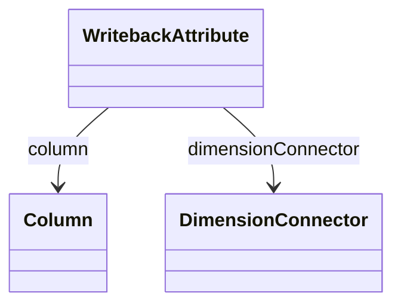

# WritebackAttribute

Defines a dimensional attribute that participates in writeback operations, enabling sophisticated data modification scenarios where users can update dimensional context information alongside measure values through interactive OLAP applications. WritebackAttribute represents a critical component of advanced business intelligence systems that support collaborative planning, budgeting, forecasting, and other scenarios where analytical applications must enable direct data modification rather than read-only consumption.

## Attributes

<table>
  <thead>
    <tr>
      <th>Name</th>
      <th>Id</th>
      <th>Type</th>
      <th>Lower</th>
      <th>Upper</th>
      <th>Default</th>
    </tr>
  </thead>
  <tbody>
  </tbody>
</table>

## References

<table>
  <thead>
    <tr>
      <th>Name</th>
      <th>Type</th>
      <th>Lower</th>
      <th>Upper</th>
      <th>Containment</th>
    </tr>
  </thead>
  <tbody>
    <tr>
      <td><strong>column</strong></td>
      <td>Column<a href="./class-Column">🔗</a></td>
      <td>1</td>
      <td>1</td>
      <td>false</td>
    </tr>
    <tr>
      <td colspan="5"><em>Required reference to the database Column that stores the dimensional attribute values that can be modified through writeback operations, establishing the physical data storage location that will receive updated values when users perform dimensional data modifications through analytical applications. The column reference defines the specific database field that will be updated during writeback operations, ensuring that dimensional changes are properly persisted to the underlying data storage while maintaining referential integrity and data consistency across the analytical system.</em></td>
    </tr>
    <tr>
      <td><strong>dimensionConnector</strong></td>
      <td>DimensionConnector<a href="./class-DimensionConnector">🔗</a></td>
      <td>1</td>
      <td>1</td>
      <td>false</td>
    </tr>
    <tr>
      <td colspan="5"><em>Required reference to the DimensionConnector that defines the relationship between this writeback attribute and the cube's dimensional structure, establishing the analytical context that determines how dimensional attribute modifications are integrated with the cube's multidimensional model and fact data relationships.</em></td>
    </tr>
  </tbody>
</table>

## Used by

- WritebackTable[🔗](./class-WritebackTable) → writebackAttribute

## ClassDiagramm

