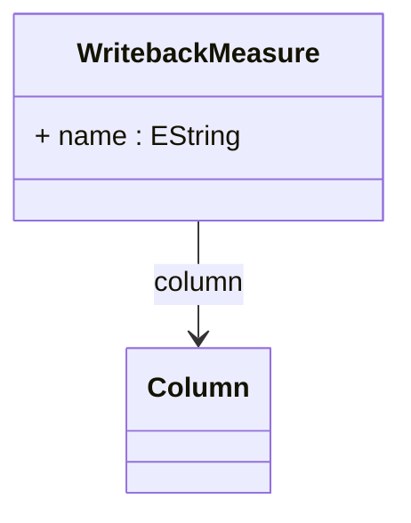

# WritebackMeasure

Defines a measure that participates in writeback operations, enabling sophisticated collaborative planning, budgeting, forecasting, and analytical data modification scenarios where business users can directly update measure values through OLAP client applications and have those changes automatically persisted to designated database tables.

## Attributes

<table>
  <thead>
    <tr>
      <th>Name</th>
      <th>Id</th>
      <th>Type</th>
      <th>Lower</th>
      <th>Upper</th>
    </tr>
  </thead>
  <tbody>
    <tr>
      <td><strong>name</strong></td>
      <td>false</td>
      <td><em>EString</em></td>
      <td>0</td>
      <td>1</td>
    </tr>
    <tr>
      <td colspan="5"><em>Logical name identifier for the measure that will be modified through writeback operations. This name is used to reference the measure in allocation policies and writeback procedures, corresponding to the measure definition in the cube schema.</em></td>
    </tr>
  </tbody>
</table>

## References

<table>
  <thead>
    <tr>
      <th>Name</th>
      <th>Type</th>
      <th>Lower</th>
      <th>Upper</th>
      <th>Containment</th>
    </tr>
  </thead>
  <tbody>
    <tr>
      <td><strong>column</strong></td>
      <td>Column<a href="./class-Column">🔗</a></td>
      <td>1</td>
      <td>1</td>
      <td>false</td>
    </tr>
    <tr>
      <td colspan="5"><em>Required reference to the database Column that stores the measure values that can be modified through writeback operations, establishing the physical data storage location where updated measure values will be persisted when users perform analytical data modifications.</em></td>
    </tr>
  </tbody>
</table>

## Used by

- WritebackTable[🔗](./class-WritebackTable) → writebackMeasure

## ClassDiagramm

